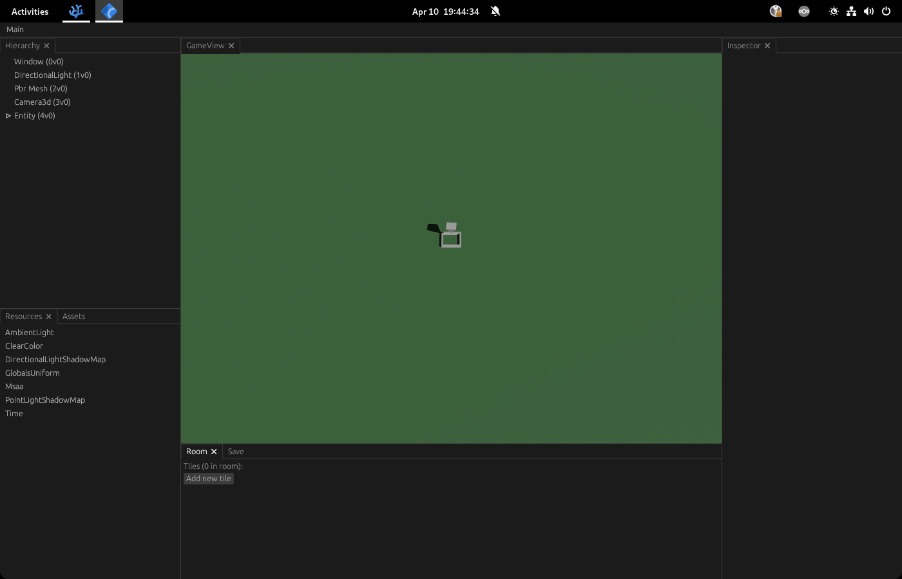

> [Go back to Devlog](/projects/crygotchi/devlog/)

# Crygotchi Devlog 00: Hello, world!

Oh boy! Getting started with this project has been convoluted. It had quite a lot going on to it and I finally started taking this project more seriously.

My goal for this whole project is simple: Make a game I can play with my brain turned off. Yet, things aren't always that simple.
Truth is, I've never made a game myself before. Working on something like this has shown to be difficult, but a fun challenge.

## Things so far

Well, I'm not entirely starting from scratch, actually from the time I'm writing this, it's the first reboot I put on this project.
Previously, I was developing this game on Unity3D. Don't get me wrong, Unity is good, but the baked potato I call my computer has shown to not like the heavy duty engine that Unity is. So, I decided to change, and for this I also wanted to pick on something new.

Rust is a relatively new programming language for me, I've been using it on/off at work, but recently started shifting gears more towards it. And with the recent discovery of Bevy, weeeeeeeelp guess what?

I'm currently working to try and get as much as done from the old Unity codebase into Rust, and things are promising.
So far, I have a very rudimentary implementation of a cursor that can move around, a data implementation of the room tiles, and a neat debugging UI.

> The neat part of it is how egui has this docking system that's so damn good. Most of the Dev UI is taken from [`bevy_inspector_egui`](https://crates.io/crates/bevy-inspector-egui) and the example script they mention

## My future plans and goals

I plan on starting to post the progress on this devlog, make some short entries, try to talk how things are going. Also, my secondary goal is to, hopefully in 3 months, have a first version of it out. Sounds far away but it gives me a sense of scope and timing that will push me into dedicating myself into this project.
